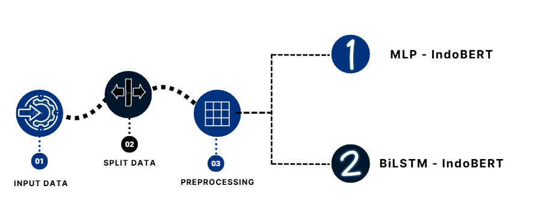
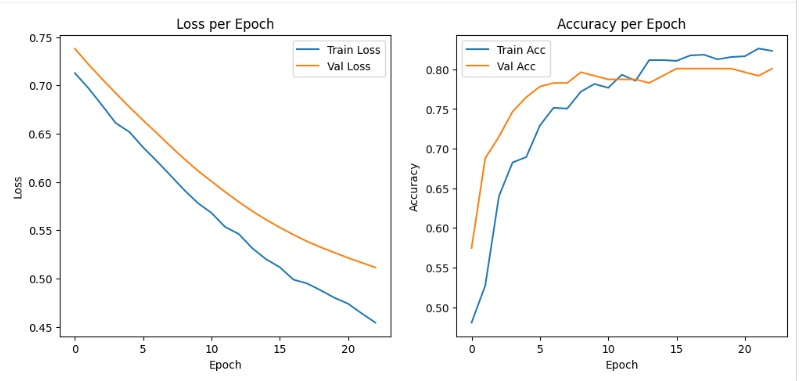
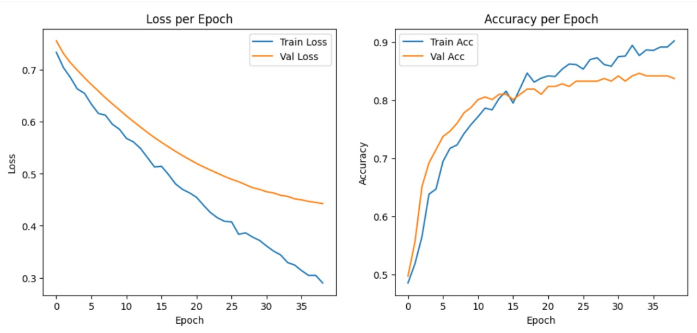

# Comparing MLP and BiLSTM Architectures with IndoBERT Embeddings for Indonesian Text Classification

## Deskripsi
Proyek ini bertujuan untuk membandingkan performa arsitektur **Multi-Layer Perceptron (MLP)** dan **Bidirectional Long Short-Term Memory (BiLSTM)** dengan menggunakan **IndoBERTweet embeddings** untuk klasifikasi teks berbahasa Indonesia.  
Eksperimen ini menggunakan dataset komentar TikTok terkait proyek **IKN (Ibu Kota Negara)** untuk tugas analisis sentimen biner (positif/negatif).  

## Install Dependencies
```bash
pip install -r requirements.txt
```

## Referensi

📄 Paper acuan penelitian: JCSTECH Journal

🤗 Hugging Face Model: indolem/indobertweet-base-uncased

📊 Dataset: Kaggle - Analisis Sentimen Komentar TikTok Progres IKN

## Proses Modeling
Proses modeling dilakukan melalui beberapa tahapan utama mulai dari preprocessing teks, embedding dengan IndoBERTweet, pelatihan model (MLP dan BiLSTM), hingga evaluasi performa.



## Preprocessing 
Tahap preprocessing dilakukan untuk membersihkan dan menyiapkan data teks sebelum masuk ke proses pemodelan. Langkah-langkah yang digunakan antara lain:

1. **Stemming**
   - Menggunakan **Sastrawi Stemmer** untuk mengubah kata berimbuhan menjadi bentuk dasar (contoh: *berlari* → *lari*).

2. **Stopword Removal**
   - Menghapus kata-kata umum yang tidak memiliki makna penting dalam analisis (contoh: *yang, dan, atau*).
   - Daftar stopword menggunakan **Sastrawi Stopword Remover**, dengan total sekitar **126 kata**.

## Arsitektur Model

| Parameter      | MLP + IndoBERTweet | BiLSTM + IndoBERTweet |
|----------------|--------------------|------------------------|
| Embedding_dim  | 768                | 768                    |
| Hidden_dim     | 64                 | 128                    |
| Output_dim     | 2                  | 2                      |
| Dropout        | 0.2                | 0.5                    |
| Optimizer      | Adam               | Adam                   |
| Loss Function  | Cross Entropy      | Cross Entropy          |
| Batch size     | 16                 | 16                     |
| Epochs         | 100                | 100                    |
| Early Stopping | ✅                 | ✅                     |


## Tabel Evaluasi Score

| Model      | Accuracy | F1-Score Negatif | F1-Score Positif | Recall Negatif | Recall Positif | Precision Negatif | Precision Positif |
| ---------- |----------|------------------|------------------|----------------|----------------|-------------------|-------------------|
| **MLP**    | 82.81%   | 84.80%           | 80.21%           | 90.60%         | 74.04%         | 79.70%            | 87.50%            |
| **BiLSTM** | 81.90%   | 83.61%           | 79.80%           | 87.18%         | 75.96%         | 80.31%            | 84.04%            |

## Grafik Loss & Accuracy MLP



## Grafik Loss & Accuracy Bi-LSTM


## Interpretasi & Kesimpulan

### Interpretasi 
MLP - Indobert:
- Model MLP + IndoBERTweet mencapai Akurasi 82.8%
- Precision kelas negatif (79.7%) lebih rendah dibanding positif (87.5%), tetapi recall kelas negatif (90.6%) lebih tinggi daripada kelas positif.
- Model cukup seimbang dalam memprediksi dua kelas, namun masih ada kelemahan pada kelas positif (recall = 74.04%).
- MLP dengan IndoBERTweet memberikan performa cukup baik namun masih moderat, karena model sederhana ini belum mampu menangkap konteks sekuensial teks dengan optimal.

BiLSTM - Indobert:
- Model BiLSTM + IndoBERTweet mencapai akurasi akhir 81.90%
- Precision kelas positif 84.04% sangat tinggi tetapi recal rendah 75.96%
- Kelas negatif lebih stabil (precision 80.31%, recal 87.18%) model lebih “berhati hati” pada komentar negatif dibanding positif
- LSTM dengan IndoBERT embeddings mampu memberikan performa cukup baik, tetapi masih ada ketidakseimbangan performa antar kelas dikarenakan arsitektur LSTM lebih fokus pada urutan teks

### Kesimpulan 
- Model MLP + IndoBERT adalah yang terbaik di antara kedua arsitektur, dengan akurasi 82.8%.
- Kinerja sangat baik pada kelas negatif, tetapi masih kurang optimal pada kelas positif (recall rendah), kemungkinan akibat distribusi data yang tidak seimbang.

## Contributor
@Atikarrahmanda
@nilammufidah19
@PutriSantikaMayangsari
@soufi-r
